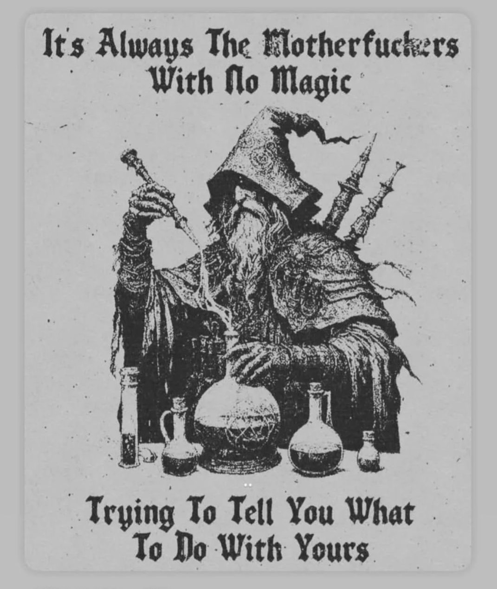
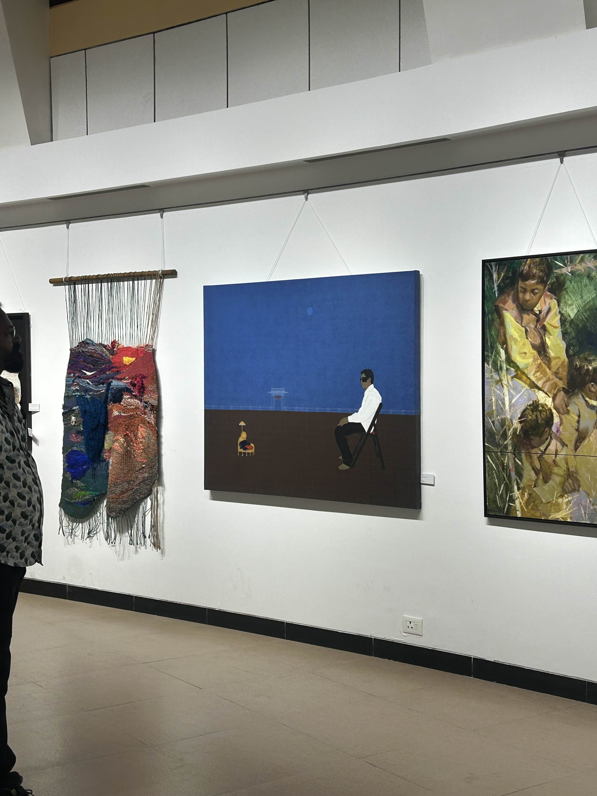

tl;dr: be intentional, take that risk, let things take time

before I dig into what actually happened, I need to address something about how I used to write. I'd open a document and just rant about what's wrong with everything, how people around me were making terrible decisions, how the world wasn't built for people trying to do things differently.

Even though barely anyone read those pieces, they still shaped how I saw myself. it put me in the category of people who complain about life but do nothing about it. this year, I became intentional about a lot of things including the thoughts i put out too

# Q1: Launch, Learn, Earn

We started loud, launched a waitlist for [align network](https://align.advtszn.xyz) got 120+ registrations and watched it die a few months later. it never even made it past the waitlist stage and i realized that what i once thought to be a great idea was a facade of vagueness

around the same time i earned my first dollar on the internet. my first paycheck ever, and it came in USD.

# Q2: The Internship Fuckery

i was in the lab preparing for an event i was hosting, thats when the companies were allotted for on-campus interviews, someone told me — "stop being an asshole and get an on-site role, it's a stamp of legitimacy for your resume."

today i wonder how many such labs exist where advice gets tossed around the room by people with no magic telling you what to do with yours

everyone else went through on-campus placements, i opted out, cold-emailed founders, some replied, some ghosted, some interviewed and eventually got referred

made good money during those 4 months of remote internship, i also stepped down from wne3 as the lead engineer after being there for almost a year (always grateful to suraj for the exposure he provided) bcs i started to feel stagnation

# Q3: The Dopamine Trap

> the above art is from jehangir art gallery back when i visited it last year, and if i recall correctly it was called "blinded by the takht"

after you experience a few wins back-to-back, you start to feel something about yourself. I definitely did and i over-indulged in a lot of bad habits — doom-scrolling, procrastination, acting without purpose or thinking about consequences.

Then the consequences showed up. i got dropped from the internship and ended up disappointing the person i was working with

around the same time was co-founding [kirrin](https://kirrin.ai) and so the prev event was more like a wake up call. i got serious about work, college had started too and i was clearly in the deep waters

i couldn't get my brain to sit and study even the day before exam the 15-year-old version of me would've been shit scared looking at his future self

Q3 was slow and boring like the calm before the storm which is probably what real progress feels like

# Q4: Stepping Down, Stepping Up

by the end of november, things started to feel like falling apart at kirrin i felt like i was in a constant stretch, building prototypes and reinventing new one before the prev was fully built or validated and in december i stepped down from my responsibilities at kirrin

i had gotten another big break the same time. i interviewed with [wldd.in](https://wldd.in) for part time role, ended up getting an internship (they said part-time roles wasn't very usual and would require more paperwork to roll out)

# What 2025 Actually Taught Me

**Accountability** - early confrontation kills the debt of dealing with ignorance later, be accountable and hold others too when needed

**Intentionality** - everything is interesting when the intent is right, take time but be intentional about your choices and work and feelings

**optionality** - biggest trap and silent killer, you can do everything but cant do everything. too many ideas will drown you, focus on shipping or making decisions early fast and often

**output over effort** - same as above, with ai execution will become fast, generation will increase in volume, treat that as a leverage to achieve balance, stop measuring yourself against false metrics (hours worked, commits created, projects built, certificates acquired)

**Work-life balance is real** - only if you're intentional about it. You can't stumble into it. You have to choose when to work, when to rest, and why each matters.

this year i was really fkn inspired by fred again and tame impala (this portfolio's design is in-fact very much influenced by the monchrome album covers of recent releases by tame impala, fred and justin bieber). another thing that really intrigued me was the marketing commercials by noice and inde wild, both these brands really understand community building and how much aesthetics of a brand carry value.

## Stats for the Year

* got my first paycheck

* turned 18

* made ₹1L by 18

* connected with friends, connecting with myself too

* still in an identity crisis, but i call it "self awareness" now
