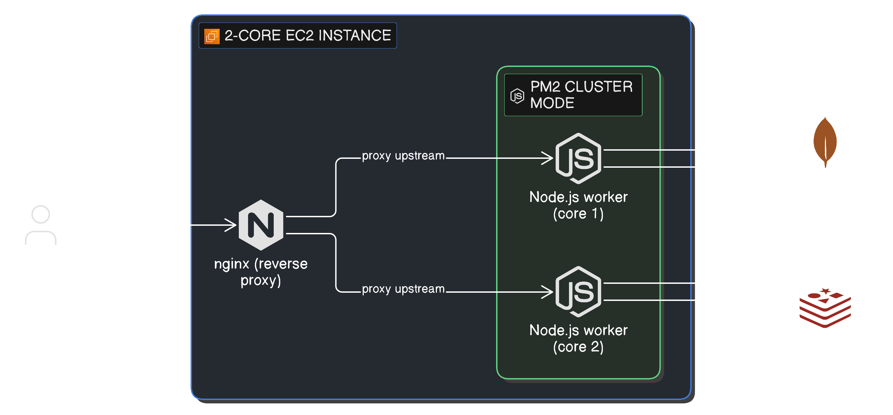
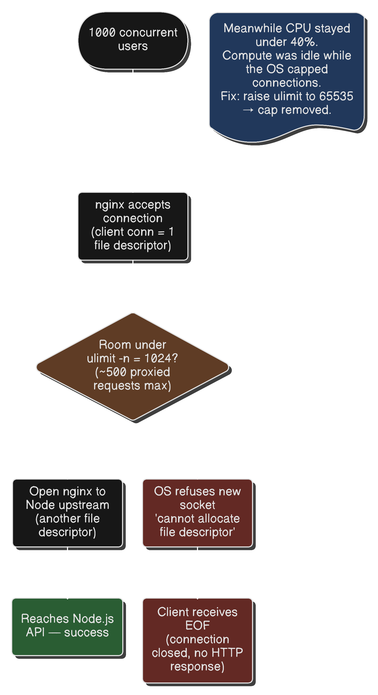
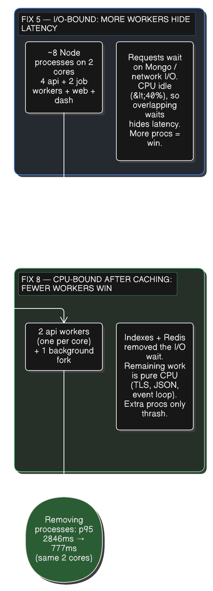

the first time i pointed 1000 virtual users at our staging API, more than half the requests failed. success rate 54.82%, p95 latency of 22 seconds, and 16,437 failed requests in a five-minute window. none of the failures were the server errors i expected. 90.6% of them were something called an EOF.

this is the log of how i got from there to a 99.96% success rate and a 777ms p95, on the exact same 2-core EC2 box, without spending a dollar more on hardware. the last leg of that came from *removing* processes, not adding them, which is the part that still feels wrong to me.

the platform is a content site: articles, quizzes, polls, communities, leaderboards. and the tech stack is depicted in the diagram belo



everything runs on a single EC2 instance with 2 CPU cores. MongoDB lives on Atlas, Redis handles leaderboard caching. i drove load with k6, simulating 1000 concurrent users across three flows: browsing (60%), quizzes (25%), and social engagement (15%). none of this touched production. the whole point was to find the ceiling in staging before real users did.

# the EOF mystery: your app never even ran

i pointed k6 at the staging API with a load profile built to test endurance, not just peak: ramp up over one minute to 1000 virtual users, then hold steady at 1000 for five minutes. sustained load, not a quick spike. this was the baseline, and it was grim.

| Metric | Run 1 |
| --- | ---: |
| Success rate | 54.82% |
| HTTP failures | 16,437 |
| Transport failures (EOF) | 14,751 |
| p95 latency | 22,221 ms |
| Request rate | 86.32 req/s |

more than half the requests failed, and this run had by far the most failures of the whole project. but they weren't the 500s or 503s i expected. 90.6% of them were EOFs, which is what sent me down the rabbit hole.

an EOF error is the network telling you "i opened a connection, and the other end hung up before saying anything", it means our application code never ran. something was killing connections *before* they reached Express.

the k6 lifecycle breakdown pointed at two separate problems:

| Phase | avg |
| --- | ---: |
| blocked (waiting for a connection slot) | 1,092 ms |
| waiting / TTFB (server processing) | 7,654 ms |

`blocked` over a second meant requests were queuing just to get a connection. a 7.6s TTFB meant the requests that *did* get through hit slow application logic. one was an infrastructure problem, one was a database problem.

# fix 1: the indexes that were quietly doing full scans

i traced the slowest endpoints from the HTTP route down to the actual MongoDB query. the highest-volume one, the paginated content feed, looked like this:

```typescript
const contents = await this.model
    .find({ deletedAt: null })
    .sort({ createdAt: -1 })
    .limit(limit)
    .skip(offset)
    .lean();

const total = await this.model.countDocuments({ deletedAt: null }); // second query
```

there was no compound index covering both the `deletedAt` filter and the `createdAt` sort. so MongoDB scanned every document, loaded all matches into memory, sorted them there, then threw away everything except one page. and then it did the whole thing again for `countDocuments`. at 1000 users, that is roughly 2000 concurrent full scans funneling through one connection pool.

i added four compound indexes, all with `partialFilterExpression: { deletedAt: null }` so the index only stores non-deleted documents. since every query in the codebase filters `deletedAt: null`, the index stays fully covering but smaller and cheaper to maintain.

# fix 2: one idle core

Node is single-threaded. on a 2-core box, one core was doing everything and the other sat idle. i ran the API under pm2 cluster mode with 2 workers, one per core.

## run 2: the improvement i couldn't see

success climbed 19 points to 74.11% and EOFs nearly halved (14,751 to 7,855), but p95 barely moved. worse, TTFB went *up*, from 7.6s to 8.5s.

the slowest requests in run 1 were dying as EOF before k6 could measure them. now they survived, completed, and got counted, which dragged the average up. the indexes had made individual queries faster, but the connection bottleneck was still masking it.

# fix 3: the OS was the ceiling all along

my CTO's suggestion: watch `htop` during the test. if CPU isn't the bottleneck, it's connection limits.

CPU stayed under 40% on both cores for the entire five minutes. the box had compute to spare and was refusing to use it. so i went looking for what was capping connections.

nginx `worker_connections` was 768. tight, but survivable. then:

```bash
$ ulimit -n
1024
```

`ulimit -n` is the max number of file descriptors a process can hold open, and here is the thing that ties this whole section back to the EOF mystery: in Unix, every TCP connection is a file descriptor. each client-to-nginx connection is one, each nginx-to-Node upstream connection is another. with a 1024 limit, nginx could hold roughly 500 concurrent proxied requests before the OS flat refused to create the next socket. request 501 got an EOF. that is why CPU was fine at 40%, why `worker_connections` didn't matter (the OS limit was lower), and why 90% of failures were EOF and not application errors.



the fix, across three layers:

```bash
# OS: raise both soft and hard limits (new login sessions only)
* soft nofile 65535
* hard nofile 65535
```

```nginx
# nginx: set its own descriptor ceiling regardless of how systemd launched it
worker_rlimit_nofile 65535;
events { worker_connections 4096; }
```

`worker_rlimit_nofile` is belt-and-suspenders: even with the OS limit raised, systemd can impose its own, so nginx sets its ceiling explicitly at startup. this needs a full `systemctl restart`, not a reload, to take effect.

## run 3: zero transport failures

| Metric | Run 1 | Run 2 | Run 3 |
| --- | --- | --- | --- |
| Success rate | 54.82% | 74.11% | 99.90% |
| Transport EOF | 14,751 | 7,855 | 0 |
| `blocked` avg | 1,092 ms | 1,411 ms | 10 ms |

zero EOFs. `blocked` dropped from over a second to 10ms. the 26 remaining failures were application-level 400s from the same virtual user liking and unliking the same content, which correctly returns a validation error. not a bug.

the connection layer was solved, and it left the lifecycle brutally honest: everything was near-zero except TTFB, which sat at 13,426ms. that number was pure server processing time, and it was the whole problem now.

# fix 4: caching the reads that never change

every request hit MongoDB directly, even for content that is identical for every anonymous user. Redis was already in the stack for leaderboards, so i extended it as a cache layer for the hottest read paths: content entities, the paginated feed, article comments, and community listings.

the design decision worth calling out is *what* to cache. for individual content lookups i cached the domain entity data, so any use case can rehydrate a full object with `Content.rehydrate()` and not care whether it came from cache or DB. for feeds i cached the entire assembled response instead. caching entity-by-entity would mean fetching a list of IDs, running MGET, handling partial misses, and stitching, which is 2-3 Redis round-trips versus one cache hit that returns the whole payload.

what i deliberately did *not* cache: per-user state like `isFollowed`. that would need one cache key per user, so 1000 users means 1000 separate entries for the same listing page, which defeats the entire point. i cache the shared data and run one cheap query for the per-user bit.

## run 4: throughput doubled

average latency dropped 75% (13,426ms to 3,329ms) and throughput nearly doubled to 223 req/s. but p95 was still 15s against a 3s target, and the per-endpoint breakdown showed why: the six slowest endpoints were all writes. you can't cache a write.

# fix 5: scaling up the workers

> this backfired later

CPU was still under 40%. the workload was I/O-bound, spending most of its time waiting on MongoDB over the network, so the cores sat idle during those waits. i doubled pm2 workers from 2 to 4. running 4 processes on 2 cores sounds wrong, but while one worker waits on a database response, another can use the idle CPU. concurrency past the core count *hides* latency when the work is waiting rather than computing.

## run 5: the biggest single jump

throughput doubled again to 467 req/s and p95 fell 55% to 6,857ms. median latency dropped to 135ms, so most requests were now genuinely fast, and the pain was entirely in the write-heavy tail. remember this fix. it comes back.

# fix 6 and 7: killing the write tail

two rounds of work went after the writes, which were now the entire problem.

**assembled response caching and denormalization.** i started caching final API responses for a few select endpoints (leaderboard, article detail etc.), so a cache hit costs zero DB queries instead of one-plus-assembly. community pages were recomputing article and quiz counts on every request via `countDocuments`, so i denormalized those counts as a subdoc.

**deferred writes.** a user who likes an article doesn't need to wait for the like *count* to increment. the frontend already does optimistic updates. so i moved engagement counters and denormalized adjustments into a BullMQ background queue, turning synchronous 3-step writes into effectively 1-step writes.

**read replicas.** an Atlas cluster is three instances by default: one primary and two secondaries. writes only go to the primary, which then replicates to the secondaries *asynchronously*, so a secondary is a full copy of the data that trails the primary by anywhere from milliseconds to seconds. the secondaries aren't special read-tuned hardware, they're just identical nodes that normally sit idle taking replication traffic. so by default all my reads *and* writes were hammering a single node while two others did nothing.

i set `readPreference: 'secondaryPreferred'` to fan reads out across the secondaries and reserve the primary for writes. the asynchronous part is the catch so session and OTP lookups were force read from primary

## run 7: all four thresholds green

write latencies fell 56-76%: a like went from 4,723ms to 1,212ms, adding a comment from 4,811ms to 1,139ms. p95 landed at 2,846ms, 154ms under the 3s target, and for the first time every threshold passed. i could have stopped here. i'm glad i didn't, because the next fix taught me the most.

# fix 8: the last 700ms came from deleting processes

this is the one fix in the whole journey that *reverses* an earlier one. fix 5 doubled the API workers from 2 to 4 and it was the single biggest win at the time. here i cut them back to 2 and got the biggest latency drop of the entire project. both were correct, because the workload underneath had changed.

by this point the box was running, on 2 vCPUs: 4 API workers (from fix 5), 2 background job workers (cluster mode at `instances: "max"`), plus a web and an internal dashboard (CMS) process. that is roughly 8 Node processes fighting over 2 cores. Node is single-threaded per process, so when busy processes outnumber cores, they don't run in parallel. they context-switch, each getting yanked off the CPU mid-work, and server-side processing time balloons even though nothing is wrong with the database or the network.

i scaled the API back to 2 workers (one per core), moved the BullMQ processor to a single fork process (a queue consumer gets its parallelism from its `concurrency` setting, not from process count).

latency dropped immediately, and throughput went *up* at the same time. fewer processes, more work done. that is the unmistakable signature of CPU oversubscription: remove contenders for the CPU and the survivors actually get to run, so latency and throughput improve together. under genuine overload, cutting capacity makes both worse. i saw the opposite, which told me the box was oversubscribed, not overloaded.

here is the lesson i keep coming back to. **the caching work didn't just make requests faster. it moved the bottleneck from I/O to CPU, which inverted the optimal number of processes.**

back at fix 5, every request sat waiting on an I/O operation (network calls to redis/mongodb), so the CPU was idle during those waits. after indexes and caching, requests are served from Redis or cheap indexed lookups. there is almost no waiting left. the time that remains is real CPU work: TLS, JSON serialization, the event loop. running 4 processes on 2 cores stopped hiding latency and started creating it. the exact same setting flipped from asset to liability.

> concurrency past your core count only helps while you're I/O-bound. every optimization that removes I/O wait pushes you toward CPU-bound, and toward *fewer* processes, not more.



so the 4-worker config was never fundamentally right. it was a workaround compensating for a slow database, and the moment i fixed the real cause, the workaround became the problem.

## run 8: sub-1s p95

p95 crashed 73% to 777ms and throughput climbed to 756 req/s, both on the same 2-core box (full numbers in the summary below). the active CPU competitors on the latency path went from 6 cluster workers to 2, exactly matching the experiment. every one of the 307,615 requests over the five-minute steady window came back successful, and 97.3% of them landed in under a second.

that same run had a *measured* p99 of 3,714ms, and the entire gap over p95 is one ~15-second window where every endpoint froze in lockstep, no errors, no restart. exclude that window and p99 drops to ~1,454ms. a box-wide freeze with no errors is the signature of a GC or swap event, likely because every process launched with a 2GB heap ceiling whose sum can exceed the box's RAM. right-sizing those heaps is next on the list, not a per-endpoint tail to chase.

# the full journey

| Run | Fix | p95 | Throughput | Success |
| --- | --- | --- | --- | --- |
| 1 | Baseline | 22,221 ms | 86 req/s | 54.8% |
| 2 | DB indexes + 2 workers | 21,758 ms | — | 74.1% |
| 3 | ulimit + nginx | 24,794 ms | 113 req/s | 99.9% |
| 4 | Redis caching | 15,293 ms | 223 req/s | 99.95% |
| 5 | 4 workers + config cache | 6,857 ms | 467 req/s | 99.96% |
| 6 | Assembled response caching | 3,700 ms | 572 req/s | 99.96% |
| 7 | Write deferral + read replicas | 2,846 ms | 570 req/s | 99.93% |
| 8 | Right-sized pm2 to cores | 777 ms | 756 req/s | 100.00% |

the shape of the work is what surprised me. i expected a scaling story to be about adding things: more workers, more cache, a bigger machine. instead the bottleneck just kept moving. the OS refused to open sockets, then missing indexes forced full scans, then uncached reads hammered the database, then write contention clogged the pool, and finally the number of processes itself became the enemy.
